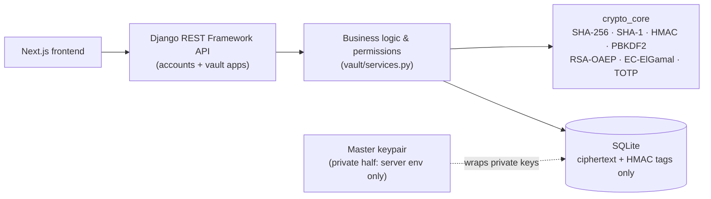

<h1 align="center">Grimoire</h1>

<p align="center">
  A client credential management system for software teams, built around the constraint<br/>
  that <b>every</b> cryptographic operation is asymmetric, and every algorithm is implemented from scratch.
</p>

---

## Overview

Grimoire models how a software company actually manages client infrastructure. When the company takes on a new client, its DevOps team purchases that client's domain registration, hosting, and email service from third-party providers and needs a safe place to store those credentials. Grimoire provides that vault, with a full approval workflow on top: a newly stored credential stays unverified until a Project Manager approves it; any later edit to an approved credential goes through a change request instead of silently overwriting it; and Backend Developers can report operational issues against a credential without ever being shown its secret values.

Every piece of sensitive data (user profiles, credential fields, project names, activity-feed messages) is encrypted before it reaches the database, using **only asymmetric cryptography**. No symmetric cipher (AES, ChaCha20, or otherwise) appears anywhere in the system, and no third-party cryptography library is used: every primitive, from SHA-256 to RSA-OAEP to elliptic-curve ElGamal, is implemented from first principles in a dedicated, dependency-free package.

## Core features

- **Asymmetric-only encryption**: RSA-2048-OAEP for bulk data, EC-ElGamal (secp256r1) for key wrapping and distribution, used for two genuinely different jobs rather than interchangeably.
- **Everything cryptographic built from scratch**: SHA-256, SHA-1, HMAC, PBKDF2, Miller-Rabin primality testing, RSA, elliptic-curve point arithmetic, and TOTP/HOTP, with no `hashlib`, `hmac`, or third-party crypto dependency.
- **Salted, iterated password hashing**: PBKDF2-HMAC-SHA256 with a random per-user salt.
- **Mandatory two-factor authentication**: a session cannot be issued without a verified TOTP code, enforced through a two-step login flow.
- **Role-based access control**: four roles (Super Admin, Project Manager, DevOps Engineer, Backend Developer), enforced server-side on every request.
- **Credential approval workflow**: new credentials require sign-off; edits to approved credentials go through reviewable change requests.
- **Message authentication on every encrypted record**: an HMAC-SHA256 tag is verified before any decryption is attempted, detecting tampering explicitly rather than relying on decryption to fail safely.
- **Secure, revocable sessions**: HMAC-signed opaque tokens (only the signature is stored server-side), device-fingerprint binding, and a user-facing session list with remote revoke.
- **Envelope-encrypted key storage**: every private key is wrapped under a system master key that never touches the database or version control.
- **Key rotation and access revocation**: a single mechanism re-encrypts a project's data and redistributes its key whenever access changes or a rotation is triggered.
- **Login rate limiting**: repeated failed attempts temporarily lock an account.
- **Project activity feed and access audit log**: a shared, encrypted record of what happened on a project, plus a separate log of who actually revealed or copied a secret value.

## Technology stack

| Layer | Technology |
|---|---|
| Backend | Django REST Framework, Python |
| Cryptography | Hand-implemented in a standalone package (`backend/crypto_core/`), no external cryptography library |
| Database | SQLite |
| Frontend | Next.js (App Router), React, TypeScript |
| Styling | Tailwind CSS |

## Architecture



The backend never performs cryptography outside of `vault/services.py` and `accounts/keys.py`, both of which call exclusively into `crypto_core`, a package with no dependency on Django, HTTP, or the database, making it independently testable against known reference vectors.

## Project structure

```
project-grimoire/
├── backend/
│   ├── accounts/       Custom user model, registration, 2FA, sessions, rate limiting, RBAC helpers
│   ├── crypto_core/    All cryptographic primitives, implemented from scratch
│   ├── grimoire/       Django project settings, master-key wrap/unwrap
│   ├── vault/          Projects, credential records, approvals, change requests, activity feed
│   ├── scripts/        One-off setup scripts (master key generation)
│   └── tests/          Unit and end-to-end test suite
└── frontend/
    ├── app/             Routed pages (Next.js App Router)
    ├── components/      UI components, organized by page/feature
    └── lib/             API client, auth/session state
```

## Getting started

### Backend

```bash
cd backend
python -m venv .venv
.venv\Scripts\activate        # Windows
# source .venv/bin/activate   # macOS/Linux

pip install -r requirements.txt
cp .env.example .env
python scripts/generate_master_key.py   # paste the printed keys into .env
python manage.py migrate
python manage.py runserver
```

`backend/.env.example` documents every required environment variable. The master keypair generated above must never be committed to version control; `.gitignore` already excludes `.env`.

Optionally, populate the database with a full demo dataset (a multi-region team, several client projects, and every workflow state):

```bash
python manage.py seed_demo
```

### Frontend

```bash
cd frontend
npm install
npm run dev
```

The application is served at `http://localhost:3000`, talking to the API at `http://localhost:8000`.

### Running tests

```bash
cd backend
python manage.py test
```

The suite covers the cryptographic primitives against known reference vectors, full HTTP-level workflows (registration through the credential-approval lifecycle), and targeted regression tests for previously identified issues.

## Academic context

This project was developed as the semester project for **CSE447: Cryptography and Cryptanalysis**, Summer 2026.
